# POKESIEA

The game was developed by Arthur HOARAU and Florian ALLARD when we were about 18 yo.

## How to play

Only for Windows OS. Launch *pokesiea.exe* to play. The game is in French only.

### Commands

Keyboard arrows to move.  
Space to interact. (talk, accept, ...).  
Escape while in game to open the menu.

## Development

### Which game engine?

No engine, no Unity, nothing... We stupidly did it from scratch in C and coded everything. It was a huge project to us and took about a year. We only used the SDL library in C.

### Cryptography

We did not want to provide the pictures of students and teachers wearing a backpack and a cap. So we decided to encrypt the images using AES 128.    
It took less than two days for an older student to break our encryption method...

## The game

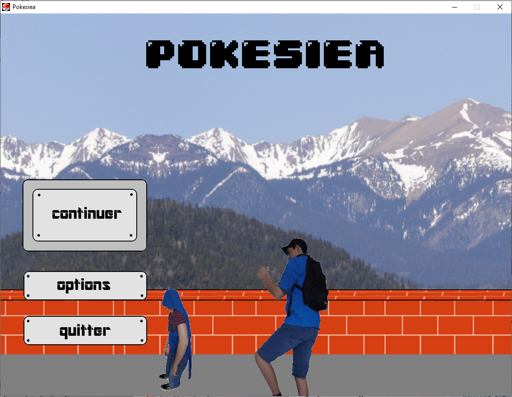 &ensp; 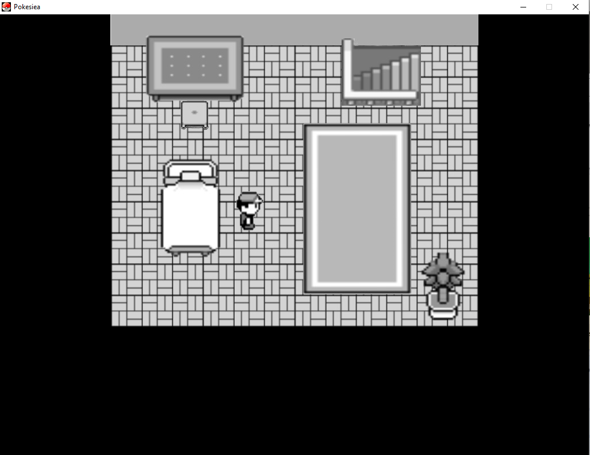 &ensp; 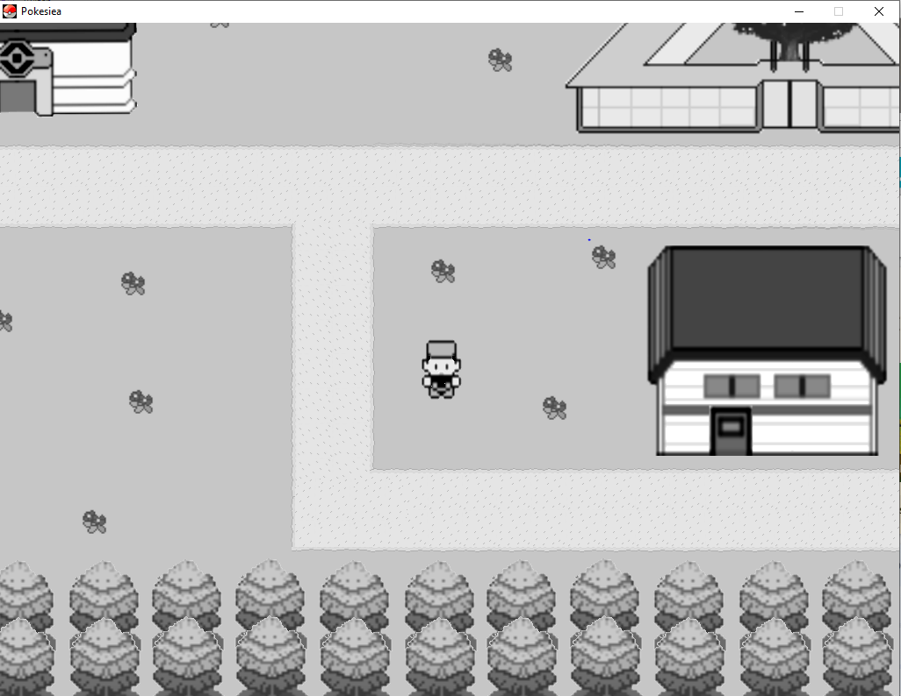
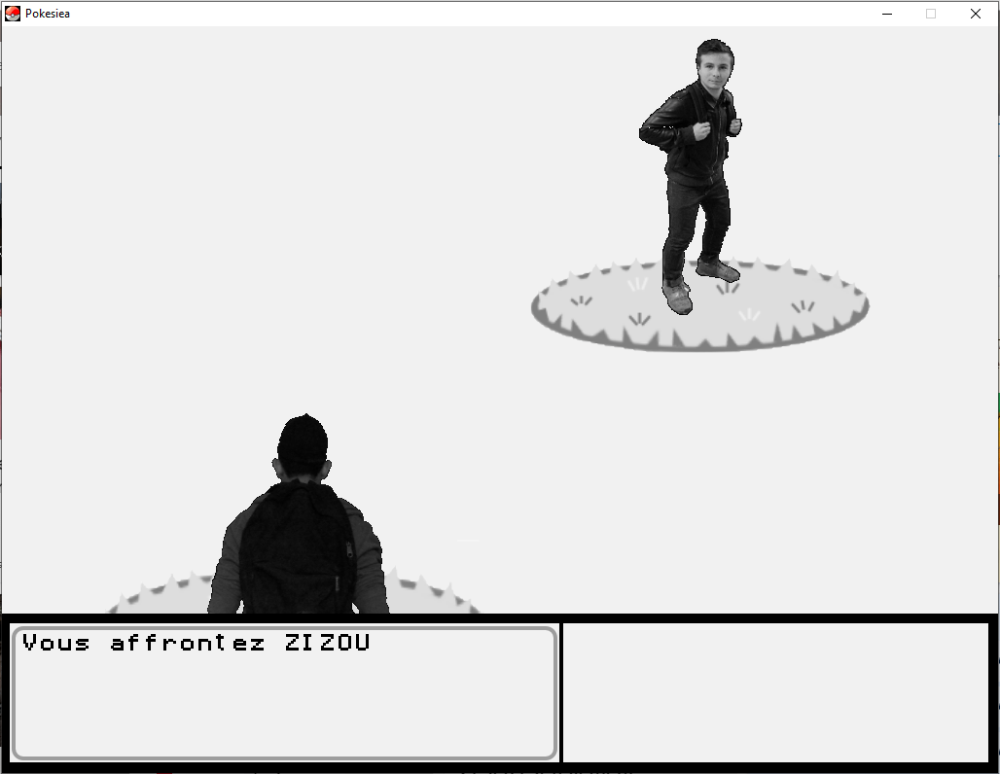 &ensp; 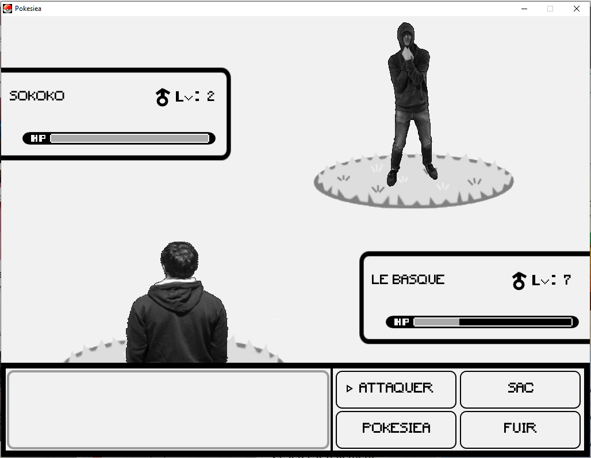 &ensp; 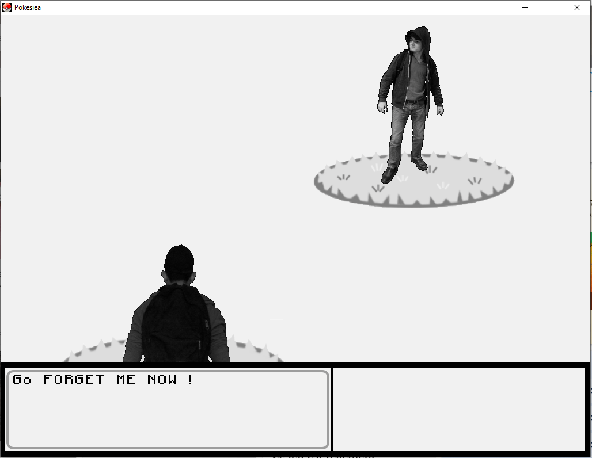 
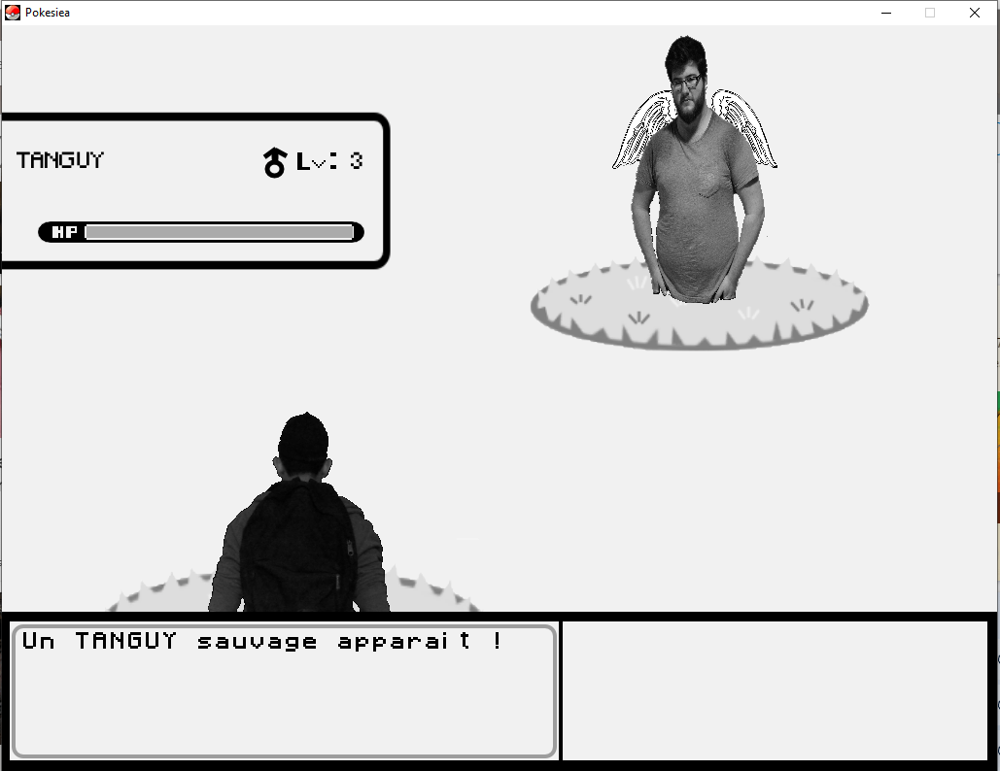 &ensp; 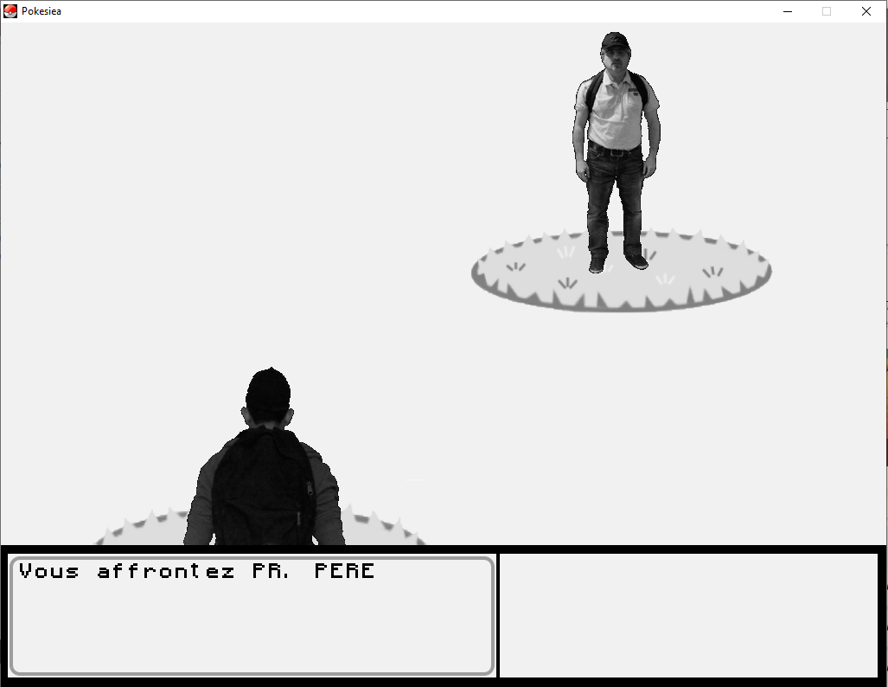 &ensp; 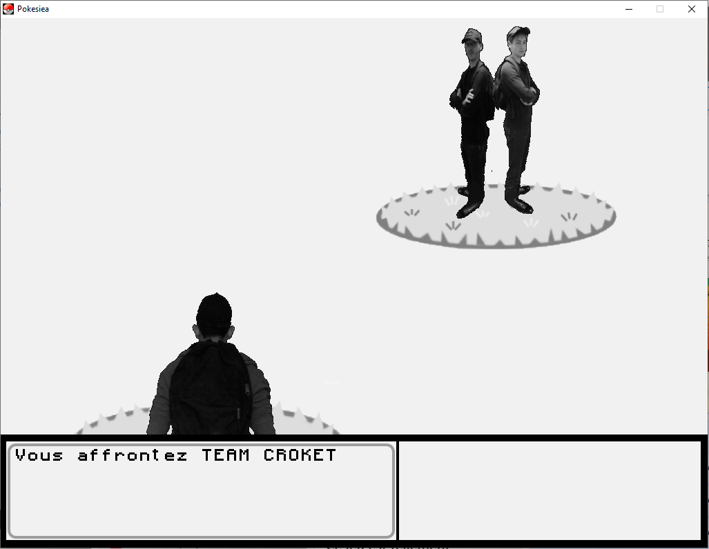    

### Background

The point was to use students, teachers of our school -> the triangle building:  
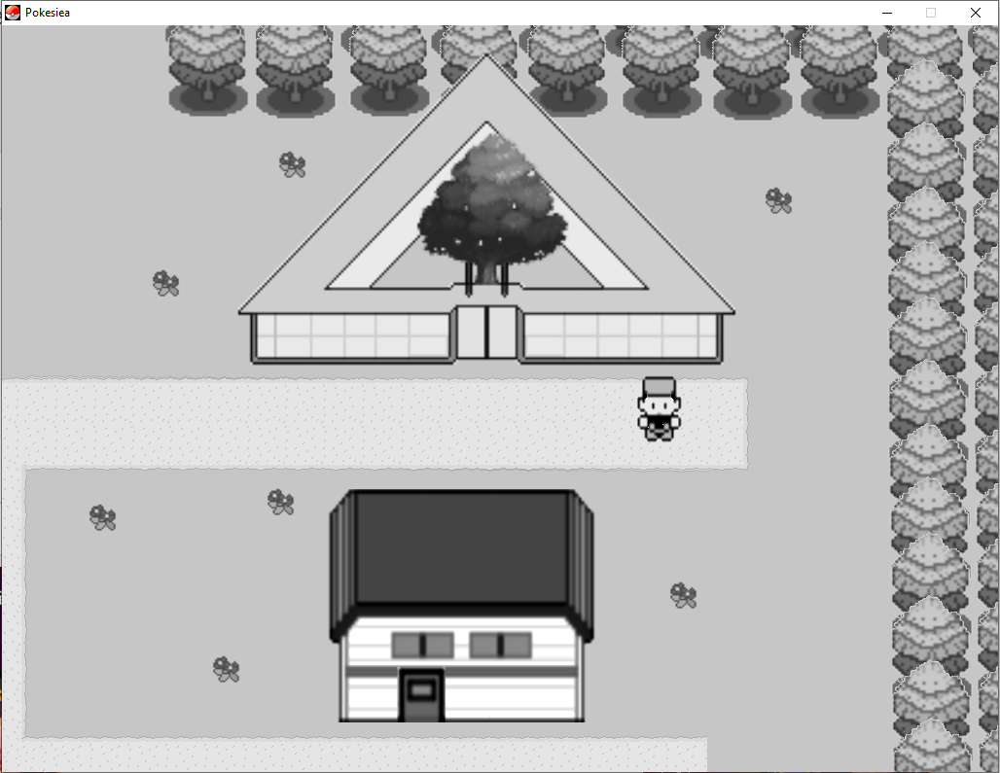 &ensp; 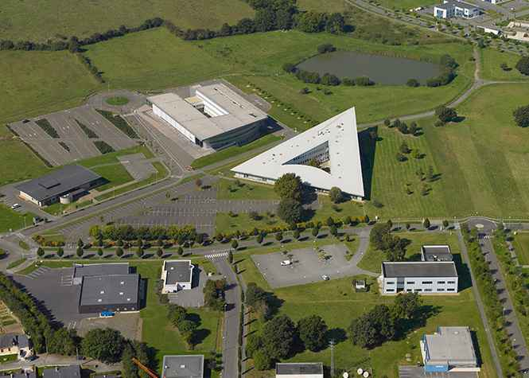
